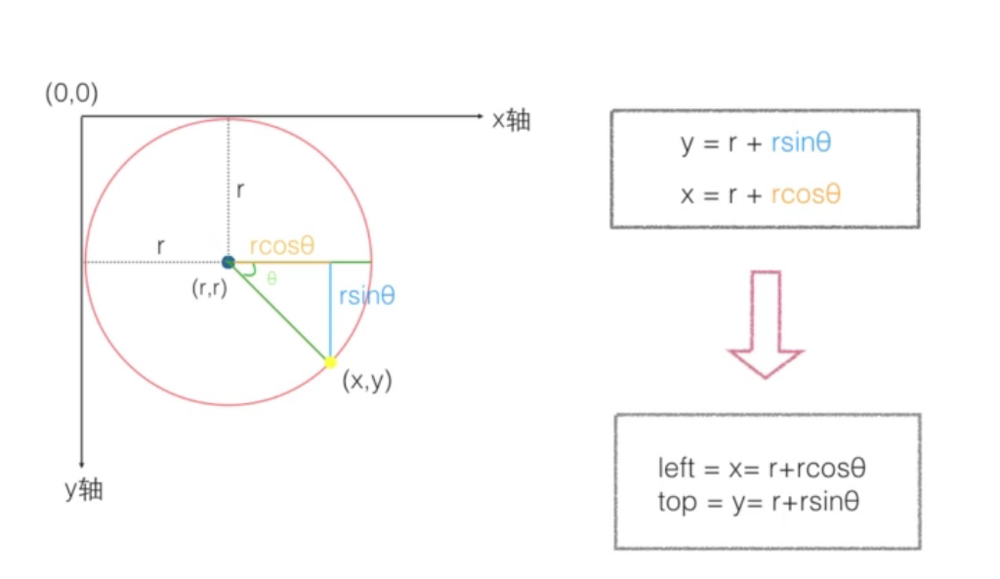

# 圆

## 弧度与角度的转换

1. 定义：圆周率（π）是圆的周长（l）与直径（d)的比值，半径（r）是直径的一半$d=2r$

   - 圆周率：$π=l÷d=l÷2r$
   - 圆周：$l=πd=2πr$

2. 定义：弧度（rad）圆心角截取的圆弧的长度

   1弧度（１rad）等于半径长度$1\,rad=r$

   - 圆的周长为2π弧度：$l＝2πr=2π\,rad$

3. 定义：角度（deg）是圆心角的弧度与圆半径的比值

   一个圆被人为规定分为360份也就是360deg，对应2π弧度：$360\,deg=2π\,rad$

   - １角度等于π/180：$1\,deg=２π\,rad÷360$ ——弧度转角度：弧度值 * 180 / π = 角度值
   - １弧度等于180/π：$1\,rad =360\,deg÷2π $ ——角度转弧度：角度值 * π / 180 = 弧度值

## 计算圆上每个点的坐标

假设一个圆的圆心坐标是(r,r)，半径为r，那么圆上每个点的坐标(x,y)：

- $x=r + cosθ×r$
- $y=r + sinθ×r$

注意：数学函数如`Math.sin(x)`或`Math.cos(x)`等中的x均是弧度值。